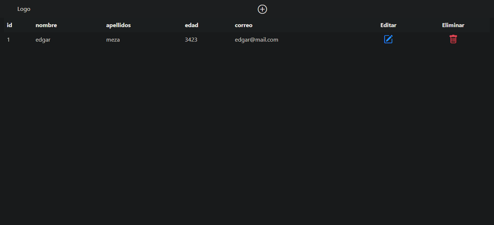
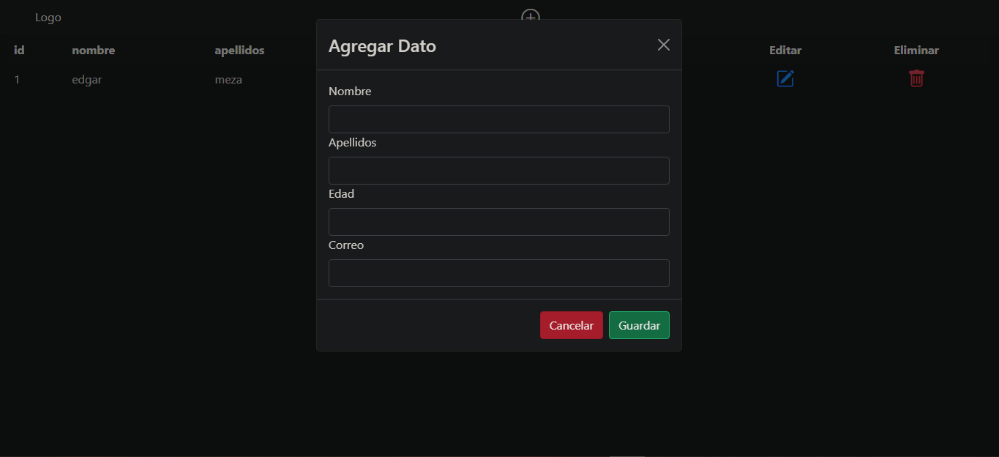
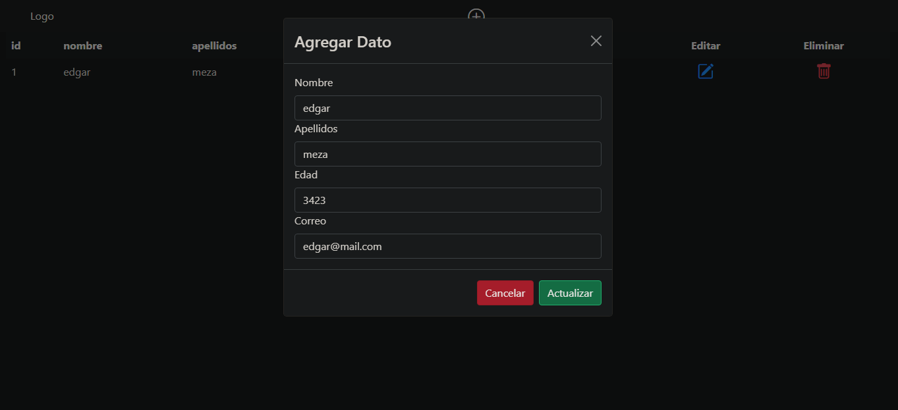
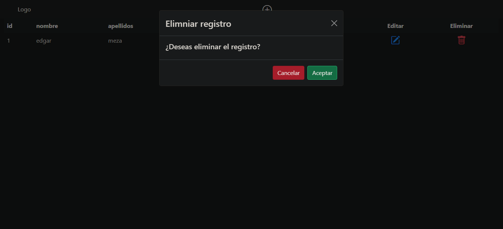

# CRUD PostgreSQL y PHP
Este es una página la cual permite realizar operaciones CRUD(Create, Read, Update y Delete) con PostgreSQL, PHP y JavaScript

Cambiar los párametros del archivo `db.php` en la carpeta `config` para poder realizar la conexión con tu base de datos PostgreSQL

~~~
    $server = "servername";
    $user = "username";
    $pass = "password";
    $db = "dbname";
    $port = "port";
~~~

## Tabla de inicio donde se muestran los registros de la DB (operación Read)

## Formulario para crear un nuevo registro (operación Create)

## Formulario para actualizar los datos de un registro (operación Update)

## Eliminar un registro de la DB (operación Delete)
